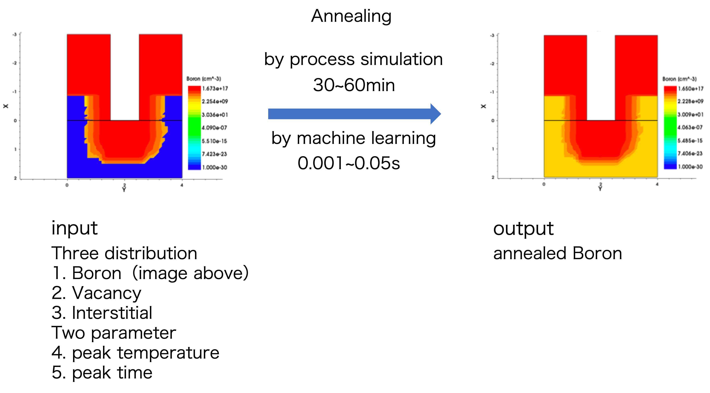

# IonImpla-SurrogateModel
A surrogate model for ion implant simulation by semantic segmentation.
Surrogate modeling is the prediction of phenomena using neural networks or other methods instead of numerical simulation.
In my research, I am applying surrogate modeling to annealing process, which is one of the semiconductor manufacturing processes.

### overview

### model structure for UNET and FcDenseNet

